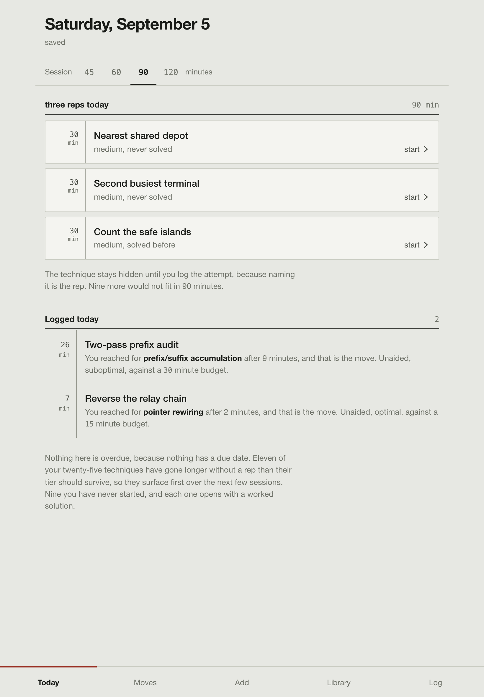
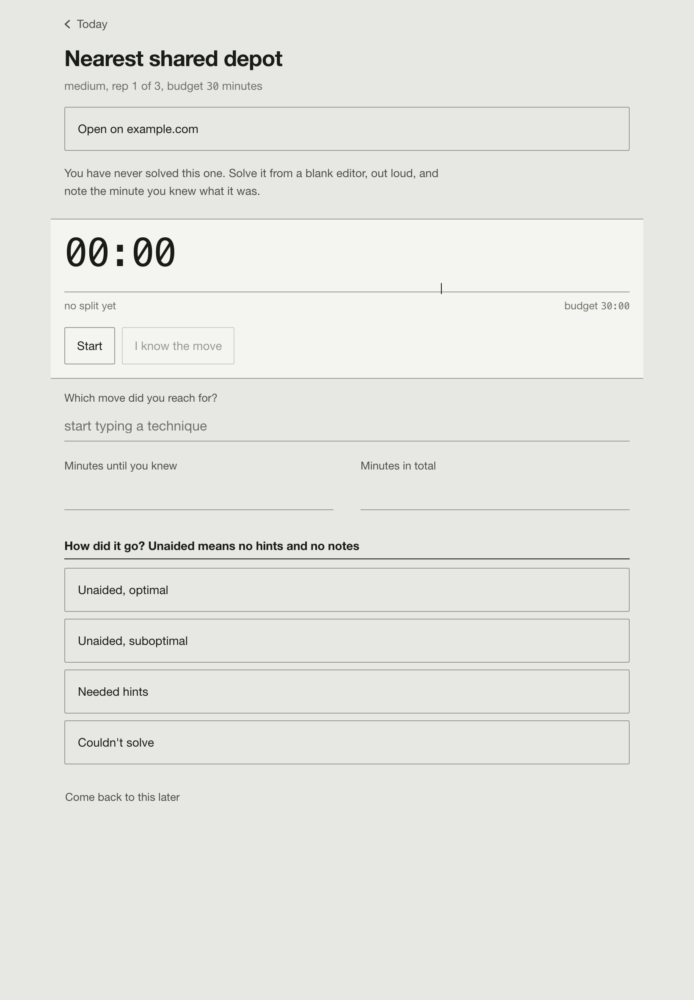
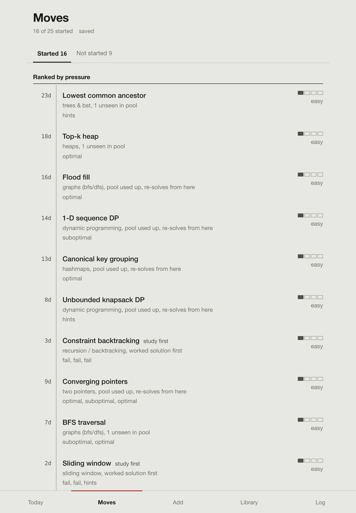
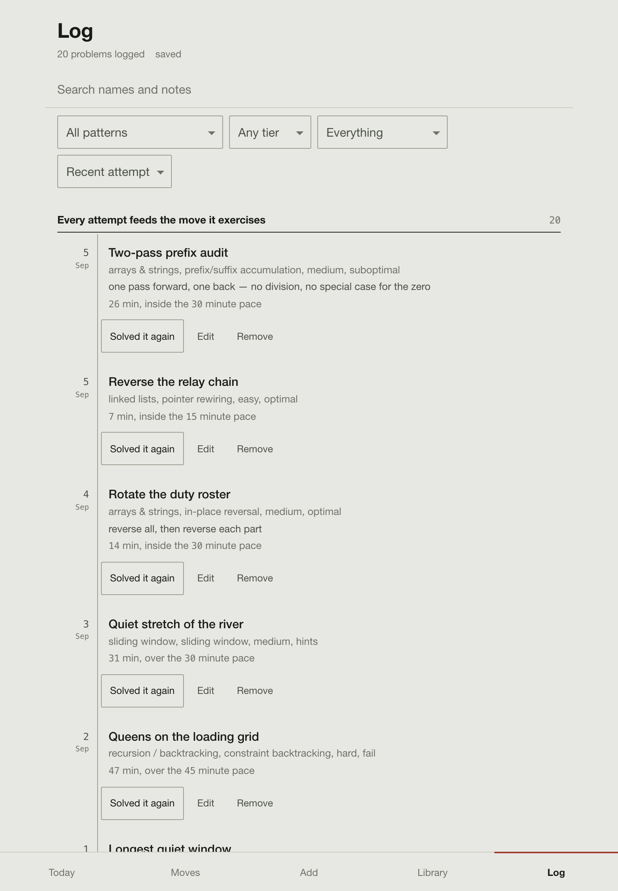

# Algo tracker

A practice journal for algorithm interviews. It schedules the technique, not the problem.

**Blind reps.** A session hands you a problem with its technique covered up. Naming the move yourself is the rep, so the cover comes off only when you log the attempt — along with which move you reached for and how long until you saw it.

**A session budget, not a due list.** Nothing is ever overdue. Techniques are ranked by how long since you last exercised one relative to how long its tier should survive, by how badly it went, and by whether it keeps beating you. You pick 45, 60, 90 or 120 minutes and get the top of that ranking that fits.

**Tiers.** Each technique carries the hardest disguise it has earned, climbed only by unaided optimal solves at interview pace on separate days and dropped by a fail. A technique you keep failing stops being served fresh problems and asks for worked solutions instead.

## Screenshots

| Today | A rep in progress |
| --- | --- |
|  |  |

| Moves | Log |
| --- | --- |
|  |  |

## Run it

```sh
npm install
npm run demo                  # sample data, http://localhost:5199
npm run dev                   # your data, http://localhost:3000
npm run build && npm start    # static build, served on :7790
```

Everything the app reads that isn't code lives in one directory — `ALGO_DATA_DIR`, default `./data`, gitignored:

```
data/catalog.json           the problems to draw from
data/state.json             your log
data/state.snapshots.json   recent revisions, for recovery
```

`npm run demo` is `ALGO_DATA_DIR=examples npm run dev` on its own port. `ALGO_TRACKER_PORT` moves the server. `/api/state` and the read-only `/api/plan` behave the same in dev and in production: both run the same handlers.

`extension/` is a Chrome extension that logs a solve from the problem page. It reimplements nothing: `npm run ext:sync` copies the rule modules into it.

## Bring your own problems

`catalog.json` is yours to write. One entry:

```json
{
  "name": "Longest quiet window",
  "category": "Sliding Window",
  "difficulty": "Medium",
  "technique": "sliding window",
  "curated": true
}
```

`category` is one of the thirteen patterns in `lib/schedule.js`. `difficulty` is Easy, Medium, Hard or Very Hard. `technique` is the fine-grained move the problem exercises — the unit that gets scheduled.

`curated: true` means you tagged it yourself, and it always joins its technique's pool. Without it, an entry is a bulk import: pooled when it names a technique, otherwise held back as a pattern-level reserve. `"seen": true` maps a problem for logging but never serves it as fresh.

Give an entry a `url` and the app opens it there. Otherwise it builds one from the file's `linkTemplate` (`{name}`, `{slug}`), which `ALGO_LINK_TEMPLATE` overrides — so one catalog opens against whatever site you practise on. `aliases` groups names that are the same problem, so a renamed twin never counts as unseen.

`examples/catalog.json` is a working file to copy.
